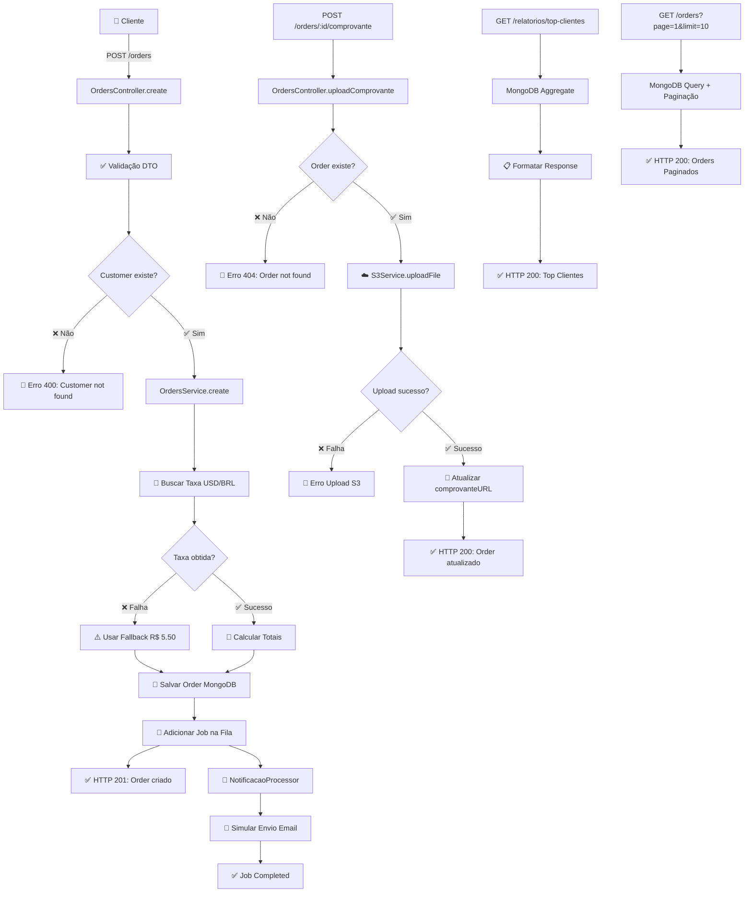

# Diagrama de Fluxo da API Commerce Flow

## Descrição do Fluxo

### Fluxo Principal de Criação de Pedidos
1. **Cliente** faz POST /orders
2. **Validação** do DTO CreateOrderDto
3. **Verificação** se o cliente existe no banco
4. **Busca da taxa** USD/BRL via API externa
5. **Cálculo** dos totais (valorTotalUSD + valorTotalBRL)
6. **Salvamento** da Order no MongoDB
7. **Adição de job** na fila Redis para processamento assíncrono
8. **Resposta** HTTP 201 com dados da Order
9. **Processamento assíncrono**: NotificacaoProcessor consome o job e simula envio de email

### Upload de Comprovantes
1. Cliente faz POST /orders/:id/comprovante com multipart/form-data
2. Verificação se a Order existe
3. Upload do arquivo para AWS S3
4. Atualização da Order com comprovanteURL
5. Resposta com Order atualizada

### Relatórios
1. GET /relatorios/top-clientes ordena clientes por valorTotalBRL decrescente
2. Usa MongoDB Aggregate com $group, $sort e $limit
3. Retorna lista de top clientes com totais gastos

### Paginação
1. GET /orders com query params page e limit
2. MongoDB query com skip e limit
3. Retorna orders paginados

## Integrações Externas
- **economia.awesomeapi.com.br**: API de câmbio USD/BRL
- **AWS S3**: Armazenamento de arquivos
- **Redis + BullMQ**: Fila de processamento assíncrono
- **MongoDB**: Banco de dados principal
